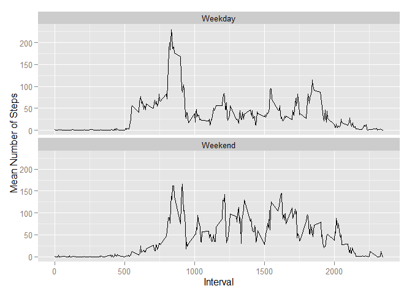

Before we dive in, we quickly load any supporting libraries.

```r
library(ggplot2)
library(dplyr)
```

```
## 
## Attaching package: 'dplyr'
## 
## The following object is masked from 'package:stats':
## 
##     filter
## 
## The following objects are masked from 'package:base':
## 
##     intersect, setdiff, setequal, union
```

```r
library(tidyr)
```

## Loading and preprocessing the data
The data is included with this HTML report along with the markdown files used to 
generate the report.

The data starts its life as a zip file, "activity.zip", in the local working
directory. We need to unzip the file, import the contents, and then clean up 
the unzipped messy-ness.

**Note:** This code assumes that your working directory has been set correctly.


```r
# unzip the file
unzip("./activity.zip")

# get the data
act <- read.csv("./activity.csv")

# clean up the csv
unlink("./activity.csv")
```

We then take a quick pause to add another date variable (in case we want to
treat our dates as dates and not as factors.)

```r
act$date_as_date <- strptime(as.character(act$date), "%Y-%m-%d")
```

## What is mean total number of steps taken per day?
Our data has many step measurements for each day.

```r
# first we get the total steps for each unique day
steps_per_day <- aggregate(steps ~ date, act, sum, na.rm = TRUE)

# then we take the mean of that aggregation
mean(steps_per_day$steps)
```

```
## [1] 10766.19
```

We may also want to consider the median value.

```r
median(steps_per_day$steps)
```

```
## [1] 10765
```

Or visualize the distribution of steps per day.

```r
ggplot(act, aes(x = date_as_date, y = steps)) + 
    geom_histogram(stat = "identity") +
    xlab("Date") +
    ylab("Number of Steps")
```

```
## Warning: Removed 2304 rows containing missing values (position_stack).
```

 

## What is the average daily activity pattern?
First we find the average steps per interval (across days).

```r
mean_per_interval <- aggregate(steps ~ interval, act, mean, na.rm = T)
```

Now we make a time series plot showing average steps over the intervals.

```r
ggplot(mean_per_interval, aes(x = interval, y = steps)) + 
    geom_line() +
    xlab("Interval") +
    ylab("Average Number of Steps")
```

 

Finally we note which of the intervals had the largest average number of steps.

```r
# sort largest to smallest, then return the first (largest) result
arrange(mean_per_interval, desc(steps))[1,]
```

```
##   interval    steps
## 1      835 206.1698
```

## Imputing missing values
Very few datasets, especially large ones, are complete - there are almost always
a few incomplete cases hiding in the data.

We have a small number of variables in the dataset, so we can simply start off
by inspecting the set of variables to see which might have missing values.

```r
summary(act)
```

```
##      steps                date          interval     
##  Min.   :  0.00   2012-10-01:  288   Min.   :   0.0  
##  1st Qu.:  0.00   2012-10-02:  288   1st Qu.: 588.8  
##  Median :  0.00   2012-10-03:  288   Median :1177.5  
##  Mean   : 37.38   2012-10-04:  288   Mean   :1177.5  
##  3rd Qu.: 12.00   2012-10-05:  288   3rd Qu.:1766.2  
##  Max.   :806.00   2012-10-06:  288   Max.   :2355.0  
##  NA's   :2304     (Other)   :15840                   
##   date_as_date                
##  Min.   :2012-10-01 00:00:00  
##  1st Qu.:2012-10-16 00:00:00  
##  Median :2012-10-31 00:00:00  
##  Mean   :2012-10-31 00:25:34  
##  3rd Qu.:2012-11-15 00:00:00  
##  Max.   :2012-11-30 00:00:00  
## 
```

The only variable with missing values is steps. Given that there are 2304 'NA'
values in steps, we can infer that there are 2304 incomplete cases in our data.

For this project, we have been asked to impute 'reasonable' values for our
incomplete cases. We will use a simple strategy of replacing any 'NA' step value
with the mean of the interval the step measurement should have occurred in.

```r
# first we define a function to replace NAs with their interval means
impute_means <- function(act, mean_per_interval) {
    # for each interval in our mean_per_interval collection...
    for(index in 1:nrow(mean_per_interval)) {
        # find which rows in our primary data match the interval AND are NA
        na_indices <- which(act$interval == mean_per_interval$interval[[index]] &
                                is.na(act$steps)
                            )
        # get the mean of the current interval
        subset_mean <- mean_per_interval$steps[[index]]
        
        # replace the NAs in the primary data for that interval with
        # the interval mean
        act$steps <- replace(act$steps, na_indices, subset_mean)
        }
    
    # return the new dataset
    return(act)
    }

# then we call the function to get the data set with imputed values
act_imputed <- impute_means(act, mean_per_interval)

# and quickly verify that we have removed our NAs
summary(act_imputed)
```

```
##      steps                date          interval     
##  Min.   :  0.00   2012-10-01:  288   Min.   :   0.0  
##  1st Qu.:  0.00   2012-10-02:  288   1st Qu.: 588.8  
##  Median :  0.00   2012-10-03:  288   Median :1177.5  
##  Mean   : 37.38   2012-10-04:  288   Mean   :1177.5  
##  3rd Qu.: 27.00   2012-10-05:  288   3rd Qu.:1766.2  
##  Max.   :806.00   2012-10-06:  288   Max.   :2355.0  
##                   (Other)   :15840                   
##   date_as_date                
##  Min.   :2012-10-01 00:00:00  
##  1st Qu.:2012-10-16 00:00:00  
##  Median :2012-10-31 00:00:00  
##  Mean   :2012-10-31 00:25:34  
##  3rd Qu.:2012-11-15 00:00:00  
##  Max.   :2012-11-30 00:00:00  
## 
```

Now we pause and inspect how our imputation impacted our data on aggregrate. We
do this by reviewing the same summary statistics we used earlier.

```r
# first we aggregate the steps by day again
imputed_steps_per_day <- aggregate(steps ~ date, act_imputed, sum)

# now we report the mean (and how it compares with our original mean)
mean(imputed_steps_per_day$steps)
```

```
## [1] 10766.19
```

```r
mean(steps_per_day$steps) - mean(imputed_steps_per_day$steps)
```

```
## [1] 0
```

```r
# and the median (and how it compares with our original median)
median(imputed_steps_per_day$steps)
```

```
## [1] 10766.19
```

```r
median(steps_per_day$steps) - median(imputed_steps_per_day$steps)
```

```
## [1] -1.188679
```

```r
# and here's our updated histogram
ggplot(act_imputed, aes(x = date_as_date, y = steps)) + 
    geom_histogram(stat = "identity") +
    xlab("Date") +
    ylab("Number of Steps")
```

 

Our summary statistics - the mean and the median - changed little. Our 
histogram seems more nicely filled in.

## Are there differences in activity patterns between weekdays and weekends?
To answer this question, we need to discriminate by type of day. We will use
the strategy of adding a new factor specifying weekdays and weekends.

```r
# if the weekday is equivalent to Saturday or Sunday...
act_imputed$day_type <- ifelse(weekdays(act_imputed$date_as_date) == "Saturday" | 
                                   weekdays(act_imputed$date_as_date) == "Sunday", 
                               # call it a weekend
                               "Weekend", 
                               # otherwise call it a weekday
                               "Weekday")
```

Now we get the average steps by interval and day type.

```r
mean_per_interval_day <- aggregate(steps ~ interval + day_type, 
                                   act_imputed, 
                                   mean)
```


Now we can visualize step behavior across the day (i.e., over the intervals) by 
the day type (weekday v. weekend).

```r
ggplot(mean_per_interval_day, aes(x = interval, y = steps)) + 
    geom_line() +
    facet_wrap(~ day_type, ncol = 1) +
    xlab("Interval") +
    ylab("Mean Number of Steps")
```

 

To highlight the differences between day types, we can also calculate the
difference between average steps for each interval between the day types.

```r
# we can do this a few ways, but I simply "spread" the dataset so that
# weekdays and weekends are in their own column
mpid_spread <- spread(mean_per_interval_day, day_type, steps)

# then create a new column "difference" to capture the difference by interval
mpid_spread$difference <- mpid_spread$Weekday - mpid_spread$Weekend

# now I "gather" the dataframe back up, treating "difference" as another day
# type
mpid_with_difference <- gather(mpid_spread, day_type, steps, -interval)

# and we plot the data one more time!
ggplot(mpid_with_difference, aes(x = interval, y = steps)) + 
    geom_line() +
    facet_wrap(~ day_type, ncol = 1) +
    xlab("Interval") +
    ylab("Mean Number of Steps")
```

 

For early (probably morning) intervals, our participant tended to take more
steps per interval on weekdays than on weekends. Perhaps sleeping in on the
weekend?

However, this pattern flips as we proceed to later (afternoon/evening) 
intervals. Here our participant tends to take more steps per interval on
weekends than on weekdays. Perhaps our partcipant has a desk job on weekdays?
